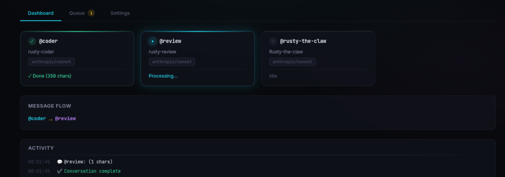

# Rusty Claw

A multi-agent AI orchestration system written in Rust. Run multiple AI coding agents (Claude, Codex, OpenCode) as persistent daemons, organize them into teams, and coordinate their work through Discord, Telegram, or the CLI.



## What It Does

- **Multiple AI agents** running in parallel, each with their own identity, memory, and working directory
- **Team coordination** — agents hand off work to teammates automatically (e.g. `@coder` writes code, then hands off to `@review`)
- **Persistent daemon** — runs in a tmux session with queue processor, channel bots, and heartbeat monitor
- **File-based queue** — JSON messages flow through `incoming/` → `processing/` → `outgoing/`
- **Smart routing** — messages routed to the right agent based on `@mentions`, keyword patterns, or priority rules
- **Browser visualizer** — real-time WASM dashboard showing teams, agents, and message flow

## Prerequisites

- **Rust** (stable toolchain) — [rustup.rs](https://rustup.rs)
- **tmux** — required for the daemon
- At least one AI CLI tool:
  - [Claude Code](https://docs.anthropic.com/en/docs/claude-code) (`claude`) for Anthropic models
  - [Codex CLI](https://github.com/openai/codex) (`codex`) for OpenAI models
  - [OpenCode](https://opencode.ai) (`opencode`) for multi-provider access

## Installation

```bash
git clone https://github.com/YOUR_USERNAME/rusty-claw.git
cd rusty-claw

# Install all binaries to ~/.cargo/bin
cargo install --path crates/rustyclaw-cli
cargo install --path crates/rustyclaw-queue
cargo install --path crates/rustyclaw-heartbeat
cargo install --path crates/rustyclaw-discord
cargo install --path crates/rustyclaw-telegram
```

This installs these binaries to `~/.cargo/bin/` (already in your PATH from rustup):
- `rustyclaw` — main CLI
- `rustyclaw-queue` — queue processor
- `rustyclaw-discord` — Discord bot
- `rustyclaw-telegram` — Telegram bot
- `rustyclaw-heartbeat` — heartbeat monitor

## Quick Start

### 1. Run the setup wizard

```bash
rustyclaw setup
```

This walks you through:
- Enabling Discord/Telegram channels (optional)
- Choosing an AI provider and model
- Creating a workspace directory
- Defining your first agent (with role description)
- Adding more agents and organizing them into teams

### 2. Start the daemon

```bash
rustyclaw start
```

This launches a tmux session with the queue processor and any enabled channel bots.

### 3. Send a message

```bash
# Send to the default agent
rustyclaw send "Build me a todo app"

# Send to a specific agent
rustyclaw send "@coder Build me a todo app"

# Send to a team
rustyclaw send "@dev Build me a todo app"
```

### 4. Check status

```bash
rustyclaw status    # Daemon status
rustyclaw logs      # View queue logs
rustyclaw attach    # Attach to the tmux session (Ctrl+B D to detach)
```

## CLI Reference

```
rustyclaw start                  Start the daemon (tmux session)
rustyclaw stop                   Stop the daemon
rustyclaw restart                Restart the daemon
rustyclaw status                 Show daemon status
rustyclaw attach                 Attach to the tmux session
rustyclaw send <message>         Send a message to the queue
rustyclaw logs [target]          View logs (queue, discord, telegram, heartbeat, all)
rustyclaw reset <agent_ids>      Reset agent conversation(s)
rustyclaw setup                  Run the interactive setup wizard
rustyclaw provider [name]        Set/show default provider
rustyclaw model [name]           Set/show default model
rustyclaw visualize [--port]     Open the browser-based visualizer

rustyclaw agent list             List all agents
rustyclaw agent add              Add a new agent interactively
rustyclaw agent remove <id>      Remove an agent
rustyclaw agent show <id>        Show agent details
rustyclaw agent reset <ids>      Reset agent conversation(s)

rustyclaw team list              List all teams
rustyclaw team add               Add a new team interactively
rustyclaw team remove <id>       Remove a team
rustyclaw team show <id>         Show team details
rustyclaw team visualize         Launch team visualizer dashboard

rustyclaw pairing pending        List pending pairing requests
rustyclaw pairing approved       List approved senders
rustyclaw pairing approve <code> Approve a pairing code
rustyclaw pairing unpair <id>    Unpair a sender
```

## Agents

Each agent has:
- **ID** — used for `@mentions` (e.g. `@coder`, `@review`)
- **Provider/Model** — which AI to use (Anthropic, OpenAI, OpenCode)
- **Working directory** — isolated workspace with its own git repo, files, etc.
- **Identity files** — personality, role, and memory in `.rustyclaw/`

### Agent Identity Files

Each agent's working directory contains a `.rustyclaw/` folder:

```
agent-dir/.rustyclaw/
  SOUL.md        # Personality, vibe, worldview
  IDENTITY.md    # Role, expertise, working style
  USER.md        # Info about the user
  MEMORY.md      # Long-term notes (agent-managed)
  TOOLS.md       # System tools guide
```

The setup wizard prompts for each agent's role and writes it to `IDENTITY.md`. You can edit these files anytime to customize agent behavior.

### Adding Agents After Setup

```bash
rustyclaw agent add
```

This prompts for ID, name, provider, model, working directory, and role description.

## Teams & Collaboration

Teams are the core of how agents work together. A team groups agents that collaborate on related tasks, with a designated leader who receives messages first and delegates to teammates.

### Creating a Team

**During setup:**

```bash
rustyclaw setup
```

After adding 2+ agents, the wizard prompts you to create teams — pick members, choose a leader, and describe what the team does.

**After setup:**

```bash
rustyclaw team add
```

This prompts for:
- **Team ID** — used for `@mentions` (e.g. `@dev`)
- **Team name** — display name (e.g. "Development Team")
- **Description** — what the team does (e.g. "Code, review, and test cycle")
- **Members** — select from your agents
- **Leader** — who receives messages first

**Managing teams:**

```bash
rustyclaw team list              # See all teams and members
rustyclaw team show dev          # Details for a specific team
rustyclaw team remove dev        # Delete a team
```

### How Collaboration Works

**1. Message arrives at the team:**

```bash
rustyclaw send "@dev Build a REST API for user authentication"
```

The message goes to the team leader (e.g. `@coder`).

**2. Leader does the work and hands off:**

After `@coder` finishes implementing, it mentions a teammate in its response:

```
[@review: The auth API is implemented in src/auth.rs. Please review for
security issues, especially the JWT token handling and password hashing.]
```

**3. Queue processor detects the handoff** and automatically routes the message to `@review`. The review agent gets the full context — both the shared response and the directed message.

**4. Chain continues** — `@review` can hand back to `@coder` with feedback, or hand off to another agent.

### Handoff Syntax

Agents can trigger handoffs in three ways:

**Bracket syntax** (explicit, recommended in agent instructions):
```
[@review: Please review this code for security issues]
```

**Cross-team syntax** (reaches agents outside the current team):
```
[@!devops: This needs to be deployed to staging]
```

**Natural mentions** (agents do this on their own):
```
@review — the implementation is complete, please check it.
@review: code is ready for your eyes.
```

All three are detected automatically. Multiple agents can be mentioned in a single response, and the queue processor creates parallel branches for each.

### Example Team Setup

A typical development team:

| Agent | Role | Model |
|-------|------|-------|
| `@coder` | Writes and debugs code | Claude Opus |
| `@review` | Reviews code for bugs, security, and style | Claude Sonnet |
| `@rusty-the-claw` | Project coordinator, answers questions | Claude Sonnet |

```bash
# Create the team
rustyclaw team add
# Team ID: dev
# Team name: Development Team
# Description: Code, review, and test cycle for software development
# Members: [x] coder  [x] review  [x] rusty-the-claw
# Leader: @coder
```

Now `rustyclaw send "@dev Build a todo app"` goes to `@coder`, who builds it and hands off to `@review` for code review.

### Agent Identity & Roles

Each agent knows its role through identity files in its working directory. The setup wizard prompts for a role description and writes it to `.rustyclaw/IDENTITY.md`:

```markdown
# Identity — Coder

## Role
Writes and debugs code, implements features, fixes bugs

## Expertise
<!-- Fill in as you work -->

## Working Style
- Read before writing. Understand the codebase before changing it.
- Ask when unclear. Don't guess at requirements.
- Ship working code. Test before declaring done.
```

You can also customize the agent's personality in `.rustyclaw/SOUL.md` — tone, opinions, communication style.

**To edit an existing agent's identity:**
```bash
# Find the agent's working directory
rustyclaw agent show coder

# Edit the files directly
vim ~/rustyclaw-workspace/coder/.rustyclaw/IDENTITY.md
vim ~/rustyclaw-workspace/coder/.rustyclaw/SOUL.md
```

### Conversation Flow

```
User sends "@dev Fix the login bug"
        │
        ▼
  Team leader (@coder) receives message
        │
        ▼
  @coder investigates and fixes the bug
  Response: "[@review: Fixed the login bug in auth.rs, please verify]"
        │
        ▼
  Queue processor detects @review mention
  Routes message to @review with full context
        │
        ▼
  @review checks the fix
  Response: "Looks good, the fix is correct. ✓"
        │
        ▼
  Final response sent back to user
```

## Supported Providers & Models

| Provider | Models |
|----------|--------|
| Anthropic | `sonnet` (Claude Sonnet 4.5), `opus` (Claude Opus 4.6) |
| OpenAI | `gpt-5.3-codex`, `gpt-5.2` |
| OpenCode | `opencode/claude-sonnet-4-5`, `opencode/gemini-3-flash`, `opencode/gemini-3-pro`, and more |

## Channel Integration

### Discord

1. Create a bot at [discord.com/developers](https://discord.com/developers/applications)
2. Enable it during `rustyclaw setup` or add the token to `~/.rustyclaw/settings.json`
3. Invite the bot to your server

### Telegram

1. Create a bot via [@BotFather](https://t.me/BotFather) on Telegram
2. Enable it during `rustyclaw setup` or add the token to settings

## Browser Visualizer

The optional WASM dashboard shows teams, agents, and message flow in real time.

```bash
# Build the visualizer (requires trunk + wasm32 target)
rustup target add wasm32-unknown-unknown
cargo install trunk
cd crates/rustyclaw-viz
trunk build --release

# Launch it
rustyclaw visualize
# or
rustyclaw team visualize --port 8090
```

## Project Structure

```
rusty-claw/
  Cargo.toml              # Workspace manifest
  templates/              # Agent bootstrap templates
  crates/
    rustyclaw-core/       # Shared types, config, routing, pairing
    rustyclaw-cli/        # Main CLI binary
    rustyclaw-queue/      # Queue processor
    rustyclaw-discord/    # Discord bot
    rustyclaw-telegram/   # Telegram bot
    rustyclaw-heartbeat/  # Heartbeat monitor
    rustyclaw-viz/        # WASM browser visualizer
```

## Configuration

Settings live at `~/.rustyclaw/settings.json` (created by `rustyclaw setup`). You can also set `RUSTYCLAW_HOME` to change the data directory.

Runtime data:

```
~/.rustyclaw/
  settings.json           # Main config
  queue/
    incoming/             # New messages
    processing/           # Being handled
    outgoing/             # Ready to send
  logs/
    queue.log
  pairing.json            # External tool pairings
```

## License

MIT
